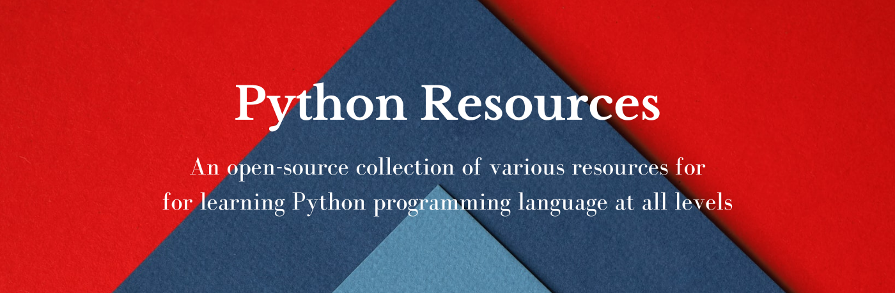

## Motivation

## Official Resources

- [Official Website](https://www.python.org/)
- [Official Tutorial](https://docs.python.org/3/tutorial/index.html)
- [Python Wiki](https://wiki.python.org/moin/FrontPage)
- [Beginner's Guide to Python](https://wiki.python.org/moin/BeginnersGuide)

## Video Tutorials
- [Corey Schaefer](https://www.youtube.com/c/Coreyms/) - Python basics
- [CS Dojo](https://www.youtube.com/c/CSDojo) - Ideal for OOPS concepts
- [Sentdex](https://www.youtube.com/c/sentdex) - Python basics and Machine Learning
- [mCoding with James Murphy](https://www.youtube.com/c/mCodingWithJamesMurphy) - Tips & tricks
- [Arjan Codes](https://www.youtube.com/c/ArjanCodes) - Interesting architecture videos
- [Tech with Tim](https://www.youtube.com/c/TechWithTim) - Small projects
- [Telusko](https://www.youtube.com/c/Telusko) - Learning Python the fun way
- [Socratcia](https://www.youtube.com/c/Socratica) - Short and interesting videos
- [Real Python](https://www.youtube.com/c/realpython) - Everything Python
- [The New Boston](https://www.youtube.com/user/thenewboston) - Python tutorials from Beginners to Advanced
- [Clever Programmer](https://www.youtube.com/c/CleverProgrammer) - Python tutorial in 1 video of 11 hours and more
